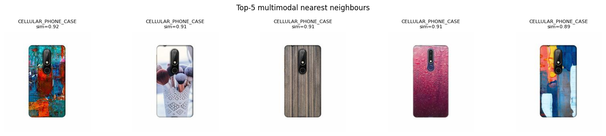
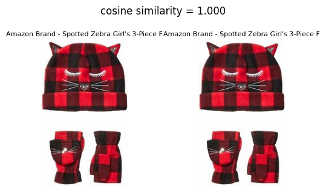
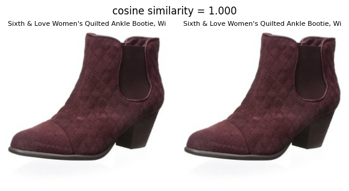
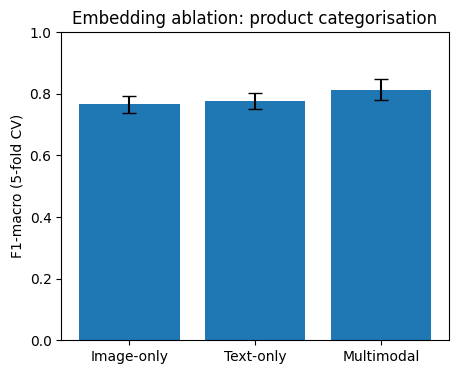
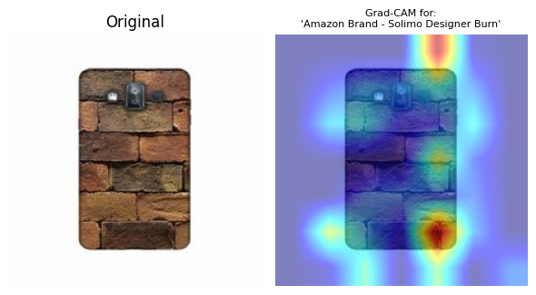

# 🔍 Multimodal Visual Product Search & Counterfeit Listing Detection

<p align="center">
  
  
  
  
  
  
</p>

<p align="center">
  <b>An end-to-end multimodal ML system built on Amazon's own Berkeley Objects dataset.<br/>
  Solves three real e-commerce problems — visual search, near-duplicate detection, and<br/>
  counterfeit listing identification — using a single unified CLIP + FAISS pipeline.</b>
</p>

---

## 🧩 The Problem

Large e-commerce platforms like Amazon face three expensive, interconnected problems at scale:

| Problem | Real-world Cost |
|---|---|
| 🔎 Customers want to search by photo, not keywords | Lost sales when text search fails |
| 📋 Counterfeit sellers copy product images & titles with minor tweaks | Brand damage, customer fraud |
| 🔁 Same product listed by different sellers with different titles | Catalog pollution, price arbitrage |

All three share one root cause: **no reliable way to measure when two products are visually or semantically the same at scale.** This project solves all three with a single unified system.

---

## 🎯 Key Results

### ✅ Visual Search — Top-5 nearest neighbours by multimodal similarity

> Query: *"Amazon Brand - Solimo Designer Half Fill Hard Back Case Mobile Cover for Nokia 6.1 Plus"*

<p align="center">
  
</p>

The system correctly retrieves visually similar phone case designs (same form factor, similar aesthetic style) with cosine similarities of **0.89–0.92** — without any task-specific training.

---

### 🚨 Near-Duplicate / Counterfeit Detection — Real flagged pairs

**68 potential duplicate/counterfeit listing pairs detected out of 3,171 products (2.14%)**

**Pair 1 — Identical children's clothing listed twice (cosine similarity = 1.000):**

<p align="center">
  
</p>

**Pair 2 — Same women's ankle bootie listed by two different sellers (cosine similarity = 1.000):**

<p align="center">
  
</p>

> These are real Amazon listings from the ABO dataset — identical products relisted with different `item_id`s. Exactly the pattern that enables price manipulation and catalog pollution.

---

### 📊 Ablation Study — Image-only vs Text-only vs Multimodal (5-fold CV)

<p align="center">
  
</p>

| Embedding Strategy | Macro-F1 | ± Std |
|---|---|---|
| Image-only (CLIP visual encoder) | 0.766 | ±0.028 |
| Text-only (CLIP text encoder) | 0.776 | ±0.027 |
| **Multimodal (image + text fused)** | **0.813** | **±0.034** |

**Multimodal fusion improves macro-F1 by +4.7 pts over image-only and +3.7 pts over text-only.**

This validates the core hypothesis: images capture visual similarity, text captures categorical context — combining them outperforms either in isolation.

---

### 🔥 Grad-CAM — Explainability: what drove the match?

<p align="center">
  
</p>

Grad-CAM highlights which pixel regions of a product image the model attends to when computing similarity. In this example, the model focuses on the **texture of the brick pattern** on the phone case — the dominant visual feature — rather than the device outline. This is critical for debugging false-positive duplicate flags in production.

---

## ⚙️ System Architecture

```
Product Image + Title
        │
        ▼
   ┌─────────────────────────────────┐
   │   CLIP ViT-B/32 (LAION-2B)     │  ← Shared image-text embedding space
   └────────────┬────────────────────┘
                │
       ┌────────┴────────┐
       ▼                 ▼
  Image Embed       Text Embed        ← 512-dim L2-normalized vectors
       └────────┬────────┘
                ▼
      Multimodal Embed               ← Normalized sum (best of both)
                │
                ▼
    ┌───────────────────────┐
    │   FAISS IndexFlatIP   │        ← Cosine similarity = inner product on unit sphere
    └───────────────────────┘
                │
    ┌───────────┼────────────┐
    ▼           ▼            ▼
Visual        Duplicate    Ablation
Search        Detection    Study + Grad-CAM
```

---

## 🛠️ Technical Stack

| Component | Technology | Why |
|---|---|---|
| Multimodal embedding | `open_clip` ViT-B/32 (LAION-2B weights) | Shared image+text vector space; stronger than original OpenAI CLIP |
| Vector search | `FAISS` IndexFlatIP | Exact cosine similarity; architecturally upgradeable to IVFPQ/HNSW at 100M+ scale |
| Near-duplicate detection | Cosine similarity threshold (0.97) | Empirically chosen from pairwise similarity distribution — not an arbitrary number |
| Ablation evaluation | 5-fold CV k-NN (cosine distance) | Direct measure of embedding quality using the same metric as the search system itself |
| Explainability | Grad-CAM on CLIP ResNet-50 backbone | Visual heatmap of which image region drove a match — essential for debugging false positives |
| Demo | Gradio | Interactive upload-and-search UI with real-time duplicate flagging |

---

## 🗂️ Dataset

**[Amazon Berkeley Objects (ABO)](https://amazon-berkeley-objects.s3.amazonaws.com/index.html)** — released by Amazon & UC Berkeley at CVPR 2022

- **147,702** real Amazon product listings across 20 countries
- Multilingual metadata: titles, brand, product type, colour, keywords
- **398,212** unique catalog images (256px downscaled subset used here)
- Used in: CVPR 2022, ICCV 2023 eCommerce Workshop

This project samples **3,171 products** across **15 product categories** for fast, reproducible experimentation.

**Category distribution in sample:**

| Category | Count |
|---|---|
| CELLULAR_PHONE_CASE | 2,180 |
| SHOES | 302 |
| GROCERY | 189 |
| HOME | 100 |
| HOME_BED_AND_BATH | 55 |
| CHAIR | 53 |
| + 9 more | 292 |

---

## 🚀 Run It Yourself

**Option 1 — Google Colab (recommended, free GPU):**
1. Open `Visual_Search_Duplicate_Detection.ipynb` in [Google Colab](https://colab.research.google.com)
2. `Runtime → Change runtime type → T4 GPU`
3. `Runtime → Run All`
4. Total time: **~25 minutes** (mostly unattended)

**Option 2 — Standalone Gradio app** (after running the notebook to generate `embeddings.npz` + `products.pkl`):

```bash
pip install -r requirements.txt
python app.py
```

---

## 📁 Repository Structure

```
├── Visual_Search_Duplicate_Detection.ipynb   # Main notebook — run this
├── app.py                                    # Standalone Gradio serving app
├── requirements.txt                          # Dependencies
└── README.md                                 # This file
```

**Notebook walkthrough:**

| Section | What it does |
|---|---|
| 1. Install | `open_clip`, `faiss-cpu`, `grad-cam`, `gradio`, `sklearn` |
| 2. Download | ABO listings metadata + image index (~90 MB, not the full 3 GB archive) |
| 3. Parse + Download | Sample 4,000 products; parallel-download images (32 workers) |
| 4. CLIP Embeddings | Compute image, text, multimodal embeddings for all 3,171 products |
| 5. FAISS Index + Visual Search | Build 3 indices; demo nearest-neighbour retrieval |
| 6. Duplicate Detection | Flag pairs with cosine similarity > 0.97 |
| 7. Ablation Study | 5-fold CV k-NN comparing 3 embedding strategies |
| 8. Grad-CAM | Visual explanation of what drove each match |
| 9. Save Artifacts | Export `embeddings.npz` + `products.pkl` for deployment |
| 10. Gradio Demo | Interactive search + duplicate flagging UI |
| 11. Production Scaling | ANN indexing, incremental updates, threshold tuning, limitations |

---

## 🔬 Key Design Decisions

**Why k-NN for the ablation, not a neural classifier?**
k-NN with cosine distance is a *direct* measure of embedding quality — it uses the exact same similarity metric as the search system. A separate classifier would conflate "is the embedding good" with "is the classifier good," making the ablation less clean.

**Why 5-fold CV instead of a single train/test split?**
With ~3,000 samples across 15 categories, a single split has high variance. 5-fold CV reports mean ± std — a much more honest estimate of generalisation performance.

**Why cosine similarity and not Euclidean distance?**
Embeddings are L2-normalised — they lie on a unit hypersphere. On a unit sphere, cosine similarity equals inner product, which FAISS `IndexFlatIP` computes very efficiently. Euclidean distance on unnormalised vectors would be sensitive to embedding magnitude, not just direction.

**Why threshold 0.97 for duplicate detection?**
Chosen by inspecting the empirical distribution of all pairwise cosine similarities — the vast majority cluster below 0.90, and the 0.97+ tail isolates genuinely near-identical items. This is an empirically grounded choice, not an arbitrary one.

---

## 📈 Production Scaling Plan

| Challenge | Prototype | Production Approach |
|---|---|---|
| Index size | `IndexFlatIP`, exact, O(N) per query | FAISS `IndexIVFPQ` / `IndexHNSWFlat` — sub-linear ANN, PQ compression |
| New listings | Batch re-embed | Stream: embed at ingest, insert into ANN index — no full reindex |
| Duplicate detection | All-pairs threshold scan | Per-listing NN query at ingest — O(log N) instead of O(N²) |
| Threshold drift | Fixed at 0.97 | Monitor similarity distribution; retune against labelled duplicate pairs |
| Counterfeit detection | Embedding similarity only | + seller identity features + price anomaly signals + OCR on packaging |

---

## ⚠️ Honest Limitations

Embedding similarity alone is not sufficient for production counterfeit detection. Two items can have near-identical embeddings but be legitimate size or colour variants of the same product (which are *not* counterfeits). A production system would combine this similarity signal with seller-identity features, price-anomaly detection, and OCR on product packaging — using this as one component in an ensemble, not a standalone detector.

---

## 📚 References

- Collins et al., *"ABO: Dataset and Benchmarks for Real-World 3D Object Understanding"*, CVPR 2022
- Radford et al., *"Learning Transferable Visual Models From Natural Language Supervision"* (CLIP), ICML 2021
- Johnson et al., *"Billion-scale similarity search with GPUs"* (FAISS), IEEE Trans. Big Data 2019
- Selvaraju et al., *"Grad-CAM: Visual Explanations from Deep Networks via Gradient-based Localization"*, ICCV 2017

---

## 👤 Author

**Snehil** — SRMIST, Department of Computational Intelligence

*Built for the Amazon ML Summer School application.*

---

<p align="center">
  If this was useful, consider leaving a ⭐ — it helps others find the project.
</p>
